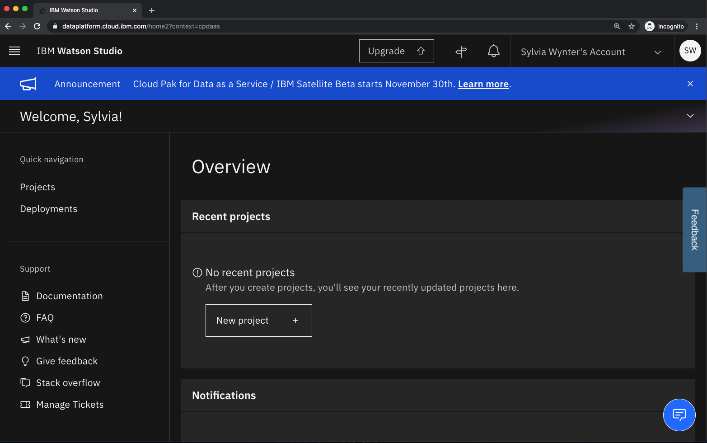
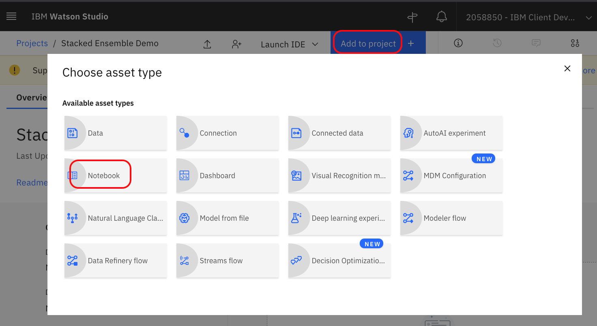
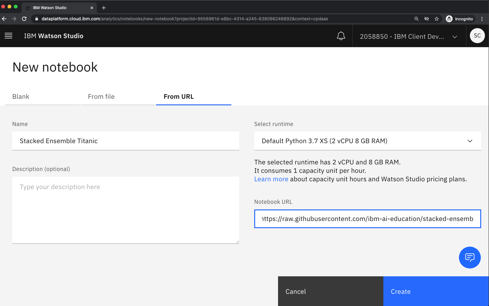
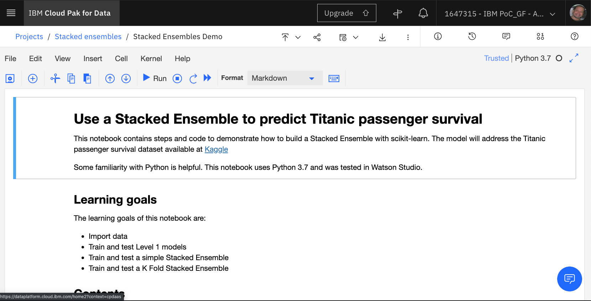

# Use a Stacked Ensemble to predict Titanic passenger survival

This repo contains steps and code to demonstrate how to build a Stacked Ensemble with scikit-learn on Watson Studio. The model will address the Titanic passenger survival dataset available at [Kaggle](https://www.kaggle.com/c/titanic).

Some familiarity with Python is helpful.

## Prerequisites

If you haven't already setup a free IBM Cloud acount and a free IBM Watson Studio account.

* [IBM Cloud account](https://cloud.ibm.com)
* [IBM Watson Studio account](https://dataplatform.cloud.ibm.com/)

## Steps

1. [Setup project in Watson Studio](#1-setup-project-and-data-in-watson-studio)
   * [Create a project in Watson Studio](#11-create-a-project-in-watson-studio)
   * [Create a notebook in Watson Studio](#12-import-the-notebook-into-watson-studio)

1. [Create and test a Stacked Ensemble model with Watson Studio](#2-create-and-test-a-stacked-ensemble-model-with-watson-studio)
   * [Start stepping through the notebook](#21-start-stepping-through-the-notebook)

### 1. Setup project in Watson Studio

In Watson Studio we need to create a project and upload our notebook.

#### 1.1. Create a project in Watson Studio

* Log into IBM's [Watson Studio](https://dataplatform.cloud.ibm.com). Once in, you'll end up on the landing page.

* Create a new project by clicking **New project +** :

   

* Enter a name for the project name and click **Create**.

#### 1.2. Import the notebook into Watson Studio

* Click on **Add to project** and then click on **Notebook**

   

* Click on the **From URL** tab, name the  notebook `Stacked Ensemble Titanic`

*  Copy and paste the following URL as the **Notebook URL**

  https://raw.githubusercontent.com/ibm-ai-education/stacked-ensembles-demo/main/notebook/stacked-ensembles-demo.ipynb

* Click **Create**

   

### 2. Create and test a Stacked Ensemble model with Watson Studio

Now that we're in our Notebook editor, we can start to create our stacked ensemble model  by stepping through the notebook.

#### 2.1 Start stepping through the notebook

* Click the `(►) Run` button to start stepping through the notebook.

## License

This code is licensed under the Apache Software License, Version 2.  Separate third party code objects invoked within this code pattern are licensed by their respective providers pursuant to their own separate licenses.

[Apache Software License (ASL) FAQ](http://www.apache.org/foundation/license-faq.html#WhatDoesItMEAN)
